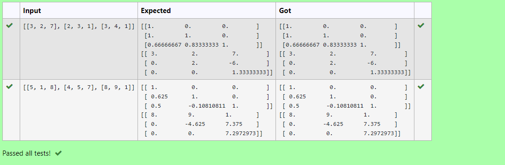
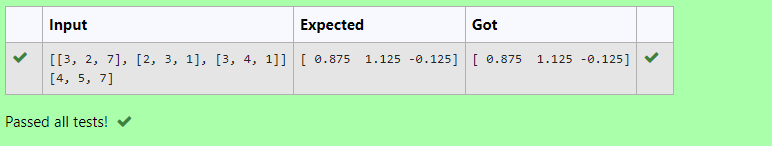

# LU Decomposition 

## AIM:
To write a program to find the LU Decomposition of a matrix.

## Equipments Required:
1. Hardware – PCs
2. Anaconda – Python 3.7 Installation / Moodle-Code Runner

## Algorithm

1. Import numpy library as np
2. Create a matrix using np.array()
3. Using scipy.linalg.lu() find L and U, also using scipy.linalg.lu_solve() get the result for LU Decomposition
4. Get the output and end the program


## Program:
(i) To find the L and U matrix
```python
'''
Program to find L and U matrix using LU decomposition.
Developed by:Tamizh selvan.R
RegisterNumber: 22002952
'''

import numpy as np
from scipy.linalg import lu
A = np.array(eval(input()))
P, L, U = lu(A)
print(L)
print(U)
```


(ii) To find the LU Decomposition of a matrix
```python
'''
Program to solve a matrix using LU decomposition.
Developed by::Tamizhselvan.R
RegisterNumber: 22002952
'''

# To print X matrix (solution to the equations)
import numpy as np
from scipy.linalg import lu_factor, lu_solve
A = np.array(eval(input()))
b = np.array(eval(input()))
lu, piv = lu_factor(A)
x = lu_solve((lu, piv), b)
print(x)
```
## Output:



## Result:
Thus the program to find the LU Decomposition of a matrix is written and verified using python programming.

